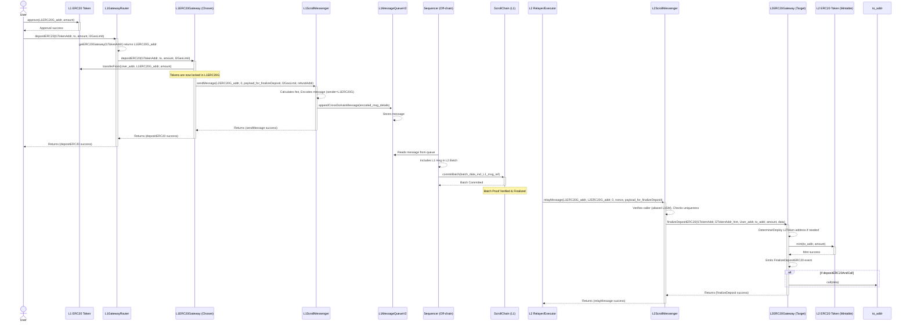

```mermaid
sequenceDiagram
    actor User
    participant L1Token as L1 ERC20 Token
    participant L1GR as L1GatewayRouter
    participant L1ERC20G as L1ERC20Gateway (Chosen)
    participant L1SM as L1ScrollMessenger
    participant L1MQV2 as L1MessageQueueV2
    participant SEQ as Sequencer (Off-chain)
    participant SC as ScrollChain (L1)
    participant L2Relayer as L2 Relayer/Executor
    participant L2SM as L2ScrollMessenger
    participant L2ERC20G as L2ERC20Gateway (Target)
    participant L2Token as L2 ERC20 Token (Mintable)

    User->>+L1Token: approve(L1ERC20G_addr, amount)
    L1Token-->>-User: Approval success

    User->>+L1GR: depositERC20(l1TokenAddr, to, amount, l2GasLimit)
    L1GR-->>L1GR: getERC20Gateway(l1TokenAddr) returns L1ERC20G_addr
    L1GR->>+L1ERC20G: depositERC20(l1TokenAddr, to, amount, l2GasLimit)
    L1ERC20G->>L1Token: transferFrom(User_addr, L1ERC20G_addr, amount)
    Note over L1ERC20G: Tokens are now locked in L1ERC20G
    L1ERC20G->>+L1SM: sendMessage(L2ERC20G_addr, 0, payload_for_finalizeDeposit, l2GasLimit, refundAddr)
    L1SM-->>L1SM: Calculates fee, Encodes message (sender=L1ERC20G)
    L1SM->>+L1MQV2: appendCrossDomainMessage(encoded_msg_details)
    L1MQV2-->>L1MQV2: Stores message
    L1SM-->>-L1ERC20G: Returns (sendMessage success)
    L1ERC20G-->>-L1GR: Returns (depositERC20 success)
    L1GR-->>-User: Returns (depositERC20 success)

    %% Off-chain and L2 processing
    SEQ->>L1MQV2: Reads message from queue
    SEQ-->>SEQ: Includes L1 msg in L2 Batch
    SEQ->>+SC: commitBatch(batch_data_incl_L1_msg_ref)
    SC-->>-SEQ: Batch Committed

    %% Later, Batch Finalization (Simplified)
    Note over SC: Batch Proof Verified & Finalized

    %% L2 Execution
    L2Relayer->>+L2SM: relayMessage(L1ERC20G_addr, L2ERC20G_addr, 0, nonce, payload_for_finalizeDeposit)
    L2SM-->>L2SM: Verifies caller (aliased L1SM), Checks uniqueness
    L2SM->>+L2ERC20G: finalizeDepositERC20(l1TokenAddr, l2TokenAddr_hint, User_addr, to_addr, amount, data)
    L2ERC20G-->>L2ERC20G: Determine/Deploy L2Token address if needed
    L2ERC20G->>+L2Token: mint(to_addr, amount)
    L2Token-->>-L2ERC20G: Mint success
    L2ERC20G-->>L2ERC20G: Emits FinalizeDepositERC20 event
    alt if depositERC20AndCall
        L2ERC20G->>to_addr: call(data)
    end
    L2ERC20G-->>-L2SM: Returns (finalizeDeposit success)
    L2SM-->>-L2Relayer: Returns (relayMessage success)

```
