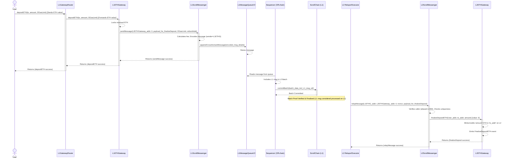

```mermaid
sequenceDiagram
    actor User
    participant L1GR as L1GatewayRouter
    participant L1ETHG as L1ETHGateway
    participant L1SM as L1ScrollMessenger
    participant L1MQV2 as L1MessageQueueV2
    participant SEQ as Sequencer (Off-chain)
    participant SC as ScrollChain (L1)
    participant L2Relayer as L2 Relayer/Executor
    participant L2SM as L2ScrollMessenger
    participant L2ETHG as L2ETHGateway

    User->>+L1GR: depositETH(to, amount, l2GasLimit) [Sends ETH value]
    L1GR->>+L1ETHG: depositETH(to, amount, l2GasLimit) [Forwards ETH value]
    L1ETHG-->>L1ETHG: Locks received ETH
    L1ETHG->>+L1SM: sendMessage(L2ETHGateway_addr, 0, payload_for_finalizeDeposit, l2GasLimit, refundAddr)
    L1SM-->>L1SM: Calculates fee, Encodes message (sender=L1ETHG)
    L1SM->>+L1MQV2: appendCrossDomainMessage(encoded_msg_details)
    L1MQV2-->>L1MQV2: Stores message
    L1SM-->>-L1ETHG: Returns (sendMessage success)
    L1ETHG-->>-L1GR: Returns (depositETH success)
    L1GR-->>-User: Returns (depositETH success)

    %% Off-chain and L2 processing
    SEQ->>L1MQV2: Reads message from queue
    SEQ-->>SEQ: Includes L1 msg in L2 Batch
    SEQ->>+SC: commitBatch(batch_data_incl_L1_msg_ref)
    SC-->>-SEQ: Batch Committed

    %% Later, Batch Finalization (Simplified for this diagram focus)
    Note over SC: Batch Proof Verified & Finalized (L1 msg considered processed on L1)

    %% L2 Execution
    L2Relayer->>+L2SM: relayMessage(L1ETHG_addr, L2ETHGateway_addr, 0, nonce, payload_for_finalizeDeposit)
    L2SM-->>L2SM: Verifies caller (aliased L1SM), Checks uniqueness
    L2SM->>+L2ETHG: finalizeDepositETH(User_addr, to_addr, amount) [value: 0]
    L2ETHG-->>L2ETHG: Mints/credits 'amount' ETH to 'to_addr' on L2
    L2ETHG-->>L2ETHG: Emits FinalizeDepositETH event
    L2ETHG-->>-L2SM: Returns (finalizeDeposit success)
    L2SM-->>-L2Relayer: Returns (relayMessage success)

```
