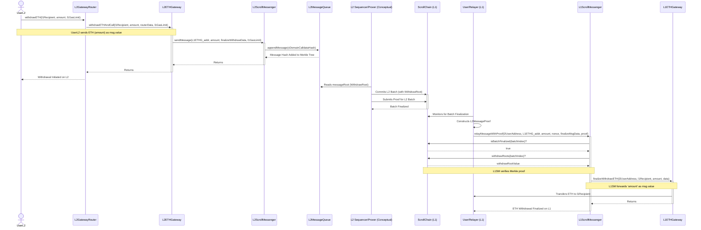

```mermaid
sequenceDiagram
    actor UserL2
    participant L2GR as L2GatewayRouter
    participant L2ETHG as L2ETHGateway
    participant L2SM as L2ScrollMessenger
    participant L2MQ as L2MessageQueue
    participant L2SeqProver as L2 Sequencer/Prover (Conceptual)
    participant SC as ScrollChain (L1)
    participant UserL1Relayer as User/Relayer (L1)
    participant L1SM as L1ScrollMessenger
    participant L1ETHG as L1ETHGateway

    UserL2->>+L2GR: withdrawETH(l1Recipient, amount, l1GasLimit)
    L2GR->>+L2ETHG: withdrawETHAndCall(l1Recipient, amount, routerData, l1GasLimit)
    Note over UserL2, L2ETHG: UserL2 sends ETH (amount) as msg.value
    L2ETHG->>+L2SM: sendMessage(L1ETHG_addr, amount, finalizeWithdrawData, l1GasLimit)
    L2SM->>+L2MQ: appendMessage(xDomainCalldataHash)
    L2MQ-->>L2SM: Message Hash Added to Merkle Tree
    L2SM-->>-L2ETHG: Returns
    L2ETHG-->>-L2GR: Returns
    L2GR-->>UserL2: Withdrawal Initiated on L2

    L2SeqProver->>L2MQ: Reads messageRoot (WithdrawRoot)
    L2SeqProver->>+SC: Commits L2 Batch (with WithdrawRoot)
    L2SeqProver->>SC: Submits Proof for L2 Batch
    SC-->>-L2SeqProver: Batch Finalized

    UserL1Relayer->>SC: Monitors for Batch Finalization
    UserL1Relayer->>UserL1Relayer: Constructs L2MessageProof
    UserL1Relayer->>+L1SM: relayMessageWithProof(l2UserAddress, L1ETHG_addr, amount, nonce, finalizeMsgData, proof)
    L1SM->>SC: isBatchFinalized(batchIndex)?
    SC-->>L1SM: true
    L1SM->>SC: withdrawRoots(batchIndex)?
    SC-->>L1SM: withdrawRootValue
    Note over L1SM, SC: L1SM verifies Merkle proof
    L1SM->>+L1ETHG: finalizeWithdrawETH(l2UserAddress, l1Recipient, amount, data)
    Note over L1SM, L1ETHG: L1SM forwards 'amount' as msg.value
    L1ETHG->>UserL1Relayer: Transfers ETH to l1Recipient
    L1ETHG-->>-L1SM: Returns
    L1SM-->>-UserL1Relayer: ETH Withdrawal Finalized on L1
```
